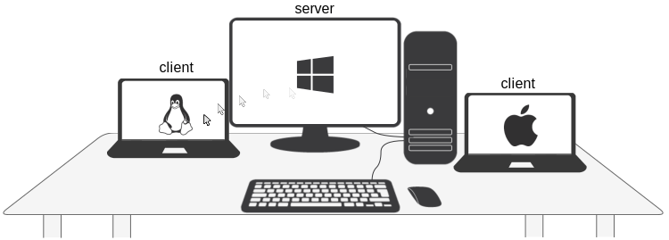

# Jerry
Jerry is a software program that enables users to control multiple computers with a single mouse and keyboard, thus eliminating the need to switch between keyboards and mice when working across multiple computers connected to the same network.

 
 

A significant advantage of this software, as opposed to the others, lies in its accurate key press interpretation, independent of the controlling computer’s current state, keyboard layout, or mapping. It ensures error-free typing of accented characters, operates without compromising system responsiveness, and imposes no limitations on virtual desktop configuration.
## Features
Keyboard:
- [x] Support for keys found on standard ANSI-104 and ISO-105 keyboards
- [x] Full support for **international keyboard layouts** 
     - [x] Accented characters (e.g., ñ, ö, ů, and ř)
     - [x] Non Latin characters  
     - [x] Dead keys
     - [x] AltGr key
- [x] Keyboard remapping softwares (e.g., PowerToys, Autohotkey) does not interfere with Jerry
- [x] Consistent typing without the need for keyboard layout synchronization

Mouse:
- [x] High resolution scrolling (vertical, horizontal)
- [x] 5 mouse buttons (left, middle, right, "back", "forward")
- [x] Mouse movement

Other features:
- [x] Switching between controlled computers
    - [x] Keyboard shortcut
    - [ ] Mouse transition
- [x] Jerry does not modify registry values or user settings
- [x] Sharing the text clipboard
- [x] Encryption
- [ ] Macro recorder
- [ ] LAN discovery

## Supported platforms

| OS     | Jerry Server          | Jerry Client          | 
| ------- | ------------------ |------------------ |
| Windows |✅ Windows 10   ✅ Windows 11|✅| 
| Linux  |⬜  | ✅ X11 ⬜ Wayland| 
| macOS |⬜  | ✅|

